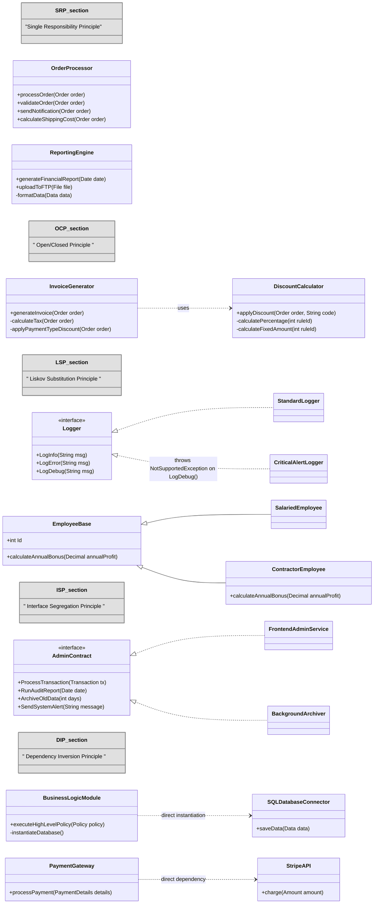

# Ejercicios SOLID

## 1. Identificación de incumplimiento de los principios SOLID

El siguiente diagrama de clases contiene varias partes de una aplicación, seccionadas por incumplimientos en los principios SOLID.

Para cada sección del diagrama se pide:

- a) Indica que problemas nos encontramos si quisiésemos cumplir con los principios SOLID. (Hay un máximo de 2 problemas por sección).

  - En el caso del SRP, indica también cuales son los motivos de cambio y/o actores que encuentres.

- b) Relaciona los problemas que has encontrado con los principios de diseño que vimos la semana pasada: _Cohesion&Acoplamiento_ y _ComposiciónVsHerencia_

> [!NOTE]
> Puedes ver el diagrama en el anexo y probarlo en [Mermaid playground](https://mermaid.live/edit)

## 2. Diseño pensando en SOLID

### Empresa: NiteBites

Una startup _app-first_ que provee snacks, bebidas y merchandising sorpresa a espacios de trabajo y eventos nocturnos.  
**Características relevantes:** suscripciones micro (daily/weekly), pedidos instantáneos desde la app, wallet interno (crédito), pagos con tarjeta y con saldo de empresa, entregas ultra-rápidas y notificaciones en tiempo real. Siempre hay pedidos y pagos: micro-transacciones frecuentes, altas tasas de concurrencia y necesidad de trazabilidad por cumplimiento.

### Ubiquitous Language (usar exactamente estos términos en inglés)

- **Customer** — usuario o empresa que pide.
- **MicroOrder** — pedido pequeño y rápido (one or a few items).
- **MicroOrderLine** — línea del pedido (item, qty, unitPriceCandidate).
- **Item** — producto disponible (SKU, stock).
- **PricingService** — calcula precio final por MicroOrder/MicroOrderLine.
- **Wallet** — saldo interno del Customer para pagos instant.
- **PaymentGateway** — Procesador externo para tarjetas.
- **PaymentMethod** — Método de pago (cash, tarjeta, crypto, bizum)
- **PaymentRequest** — Solicitud de pago
- **SplitPayment** — División de un pago en varias
- **InventoryService** — comprueba y reserva stock.
- **OrderService** — orquestador simple que valida, cobra y confirma.
- **Notifier** — envía confirmaciones (push, email, SMS).
- **AuditTrail** — registro de auditoría para las transacciones de pedidos.
- **EventBus** — publica eventos (MicroOrderCreated, MicroOrderPaid, MicroOrderFailed).

### Contexto

Un Customer crea un MicroOrder en la app. El OrderService ya obtuvo el precio total (PricingService) y la reserva de stock (InventoryService).

Ahora toca procesar el pago. El sistema permite el pago total con diferentes métodos de pago (tarjeta débito, transferencia, bizum, wallet).

Además también se permite el pago dividido en varios métodos de pago, es decir, puedo pagar un % con tarjeta y otro con bizum.

Todos los intentos de pago deben registrarse en `AuditTrail` y publicar eventos en `EventBus`.

### User Story

> _Como usuario quiero pagar mi MicroOrder con bizum, siendo notificado a través de la App_

**Descripción**:

Actualmente la app está recibiendo pedidos y los está cobrando el/la comercial asistiendo con un datáfono al espacio de trabajo.

Antes de realizar el pago se debe solicitar a un proveedor externo de morosidad (ASNEF) la autorización para poder realizar el pago.

En esta primera versión, el pago se realizará a través del proveedor Bizum, generando una transacción que se almacenará en un fichero JSON.

Todos los pagos realizados deben registrarse en un registro de auditoría de finanzas.

Cuando el pago sea realizado, se le notificará al usuario por los medios que tenga configurado en su perfil (SMS, NotificacionPush, Email)

Por último, si el pago es `ok` se le sumará a nuestro director que gestiona ese espacio un `0.5%` de la venta diréctamente a su bono anual.

**Se pide**:

Crear un diagrama de clases UML con el diseño de la feature de pago cumpliendo con los principios SOLID.

## Anexos

Se anexa el diagrama en mermaid para futuras referencias:

